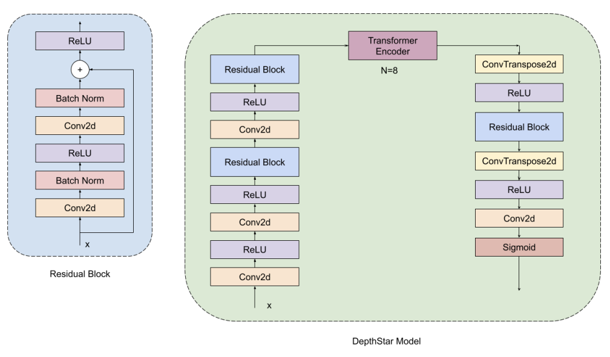

## Monocular Depth Estimation

CS 7150 final project.

Abstract: Depth estimation is a critical task in robotics for navigation, obstacle avoidance, and self-driving applications. Contemporary state-of-the-art methods typically fall into two distinct categories: designing complex networks capable of direct depth map regression, or partitioning the input into bins or windows to reduce computational complexity. This project adopts the former approach, as we wish to optimize primarily for inference speed, and secondarily depth-map accuracy. Moreover, the Monocular Depth Estimation (MDE) are limited due to high operational costs, and annotations could be affected by sensor noise, hence often low resolution. We propose DepthStar, an autoencoder model that attempts to understand the 3D scene from a single RGB image trained using synthetic dataset. The primary objective is to implement and conduct comparative analyses of CNN-based and Transformer-based architectures for depth estimation, optimizing for both accuracy and computational efficiency, with particular emphasis on edge device deployment. We evaluate DepthStar on NYU Depth v2 using Root Mean Square Error (RMSE) and Mean Absolute Error (MAE). Finally, we aim to keep the model as tiny as possible while gaining the best accuracy suitable for robotics applications.

[Full report](/pdf/cs7150report.pdf)

