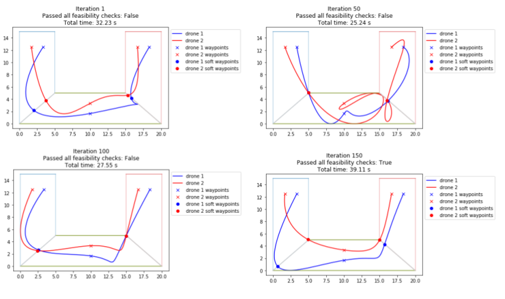
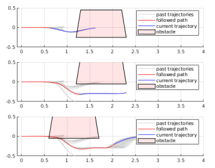
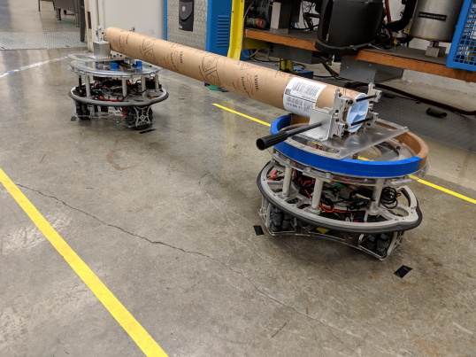
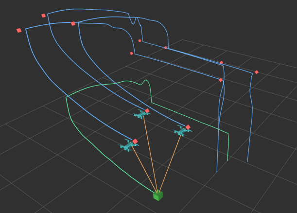

## Portfolio

---

[Monocular Depth Estimation](/depthestimation)

<image src="images/depth.png"/>

---

[Multi-Agent Trajectory Planning using Bayesian Optimization](/multiagentplanning)

---

[Safe and Coordinated Hierarchical Receding Horizon Control for Mobile Manipulators](/mobilemanipulator)

---
[Robots Carrying Suspended Loads](/olly)

---
[MPC Control for Multiple Quadcopters Cooperatively Carrying Object](/mpcdrones)

---

---
<!-- Remove above link if you don't want to attibute -->
