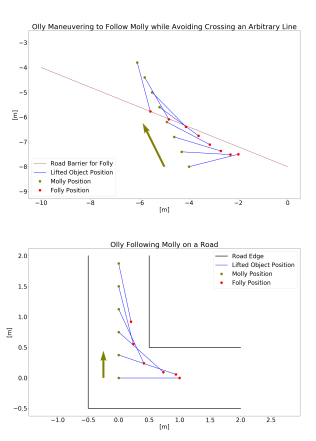

## Robots Carrying Suspended Loads

Senior design project (ME 102B): Inspired by the transportation of wind turbine blades that often involves two truck drivers coordinating driving via radio, we designed two omni-directional robots that carry a suspended load between them. The front robot is controlled via joystick input, and the rear robot follows autonomously at a fixed distance. We used LIDAR SLAM on each both robots for localization, and a MPC planner for maintaining distance within "road" boundaries and minimizing motion. 

[Full report](/pdf/me102breport.pdf)
